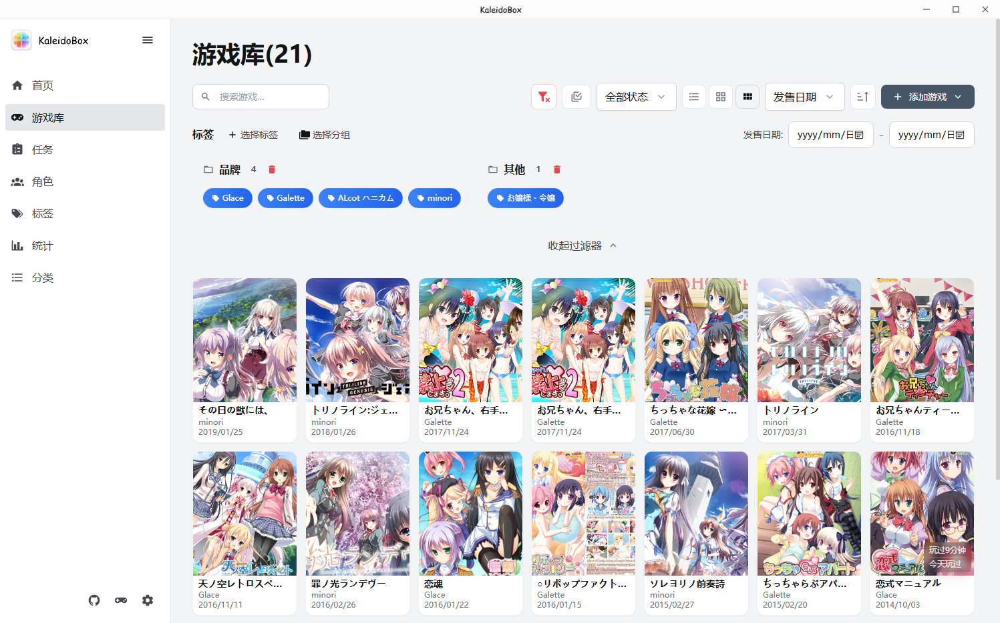
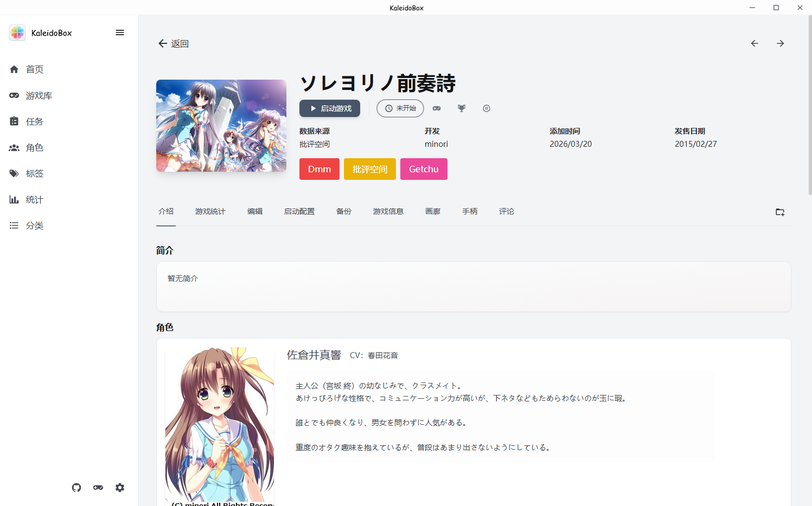
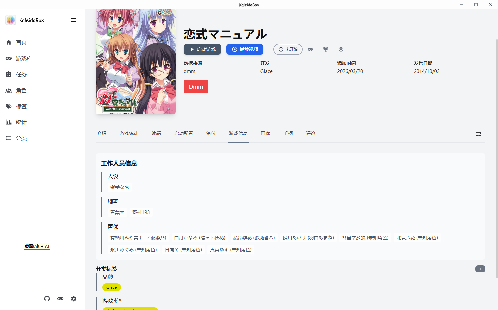
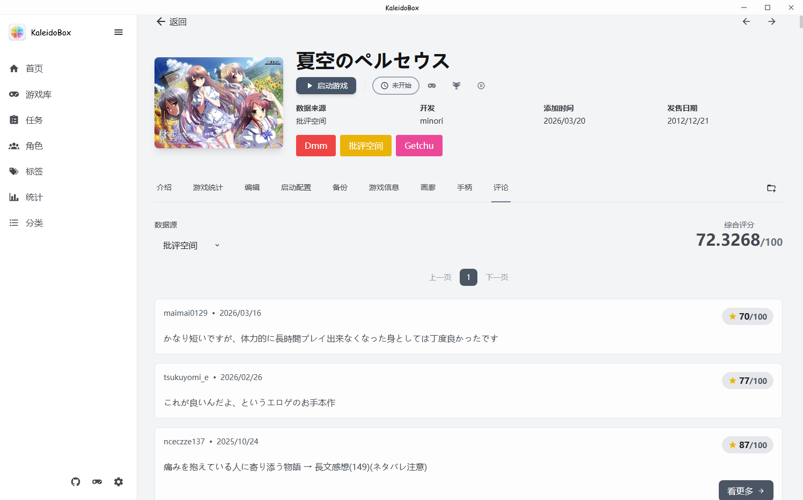
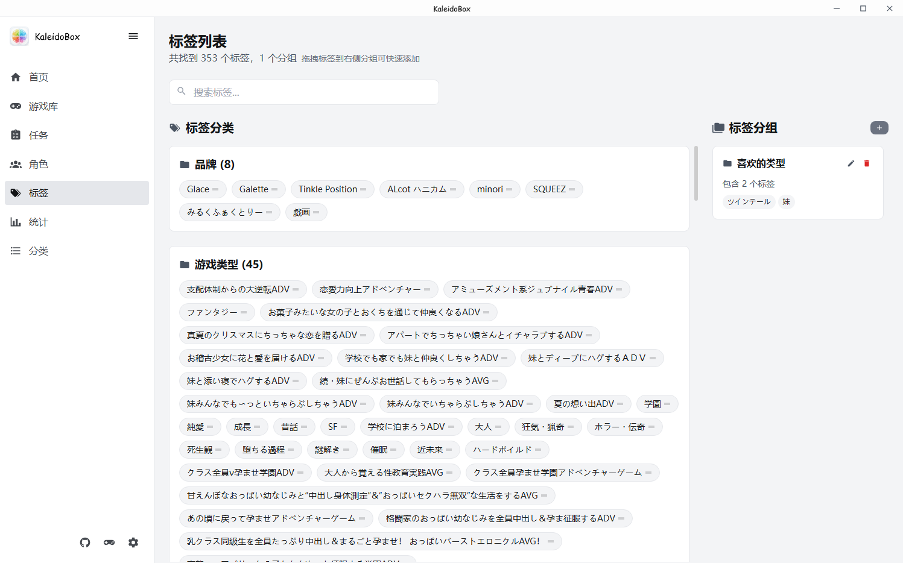
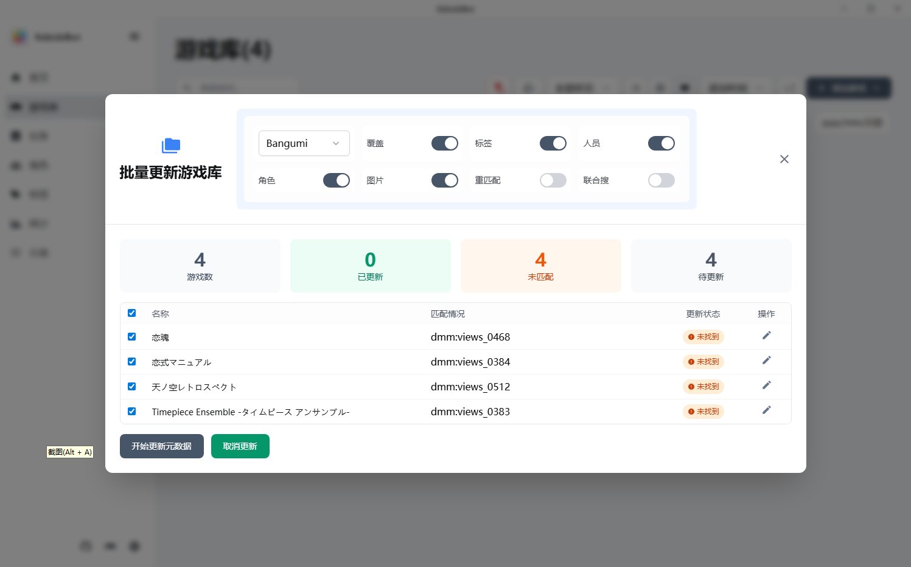

<div align="center">


# KaleidoBox

**轻量、快速、功能丰富的视觉小说管理与游玩统计工具**

[](https://go.dev/)
[](https://wails.io/)
[](https://react.dev/)

</div>

##  项目介绍

本项目是[]的Fork，这里先感谢原项目的作者。这是本人第一次做Fork，有什么不合规的请大家指出。
本项目跟原项目一样，主要是wails + go + react的结构，其实这些语言我都不太熟悉，所以本项目也是为了学习一下这些语言和架构，但实际没涉及到多少深层的东西。
项目初衷是边学习的同时边满足自己在使用原项目和其他gal管理软件时的一些想实现的需求。最大的目的是大批量添加游戏的时候尽可能一次搜刮正确的数据，。其实对这品类的软件之前一直不知道有，知道两个月前在b站看到。
之前管理gal是我的一个很大的问题，多次想过要不要做个软件去管理，不过一来不太熟悉桌面端的软件，二来懒。这次本来也只是想边学习的时候加一点小功能的，之后提request合并到原项目。
但后来想加的东西越来越多，也曾试过想跟上主项目的提交，但主项目更新太快，每次更新都得重新修改代码，而且感觉方向也走得有点远了，所以就决定还是独立起来吧。


## ✨ 特性

- **原项目特性** - 具体可看看原项目，这里主要说说新加的。
- **日本数据源** - 能爬虫日本数据源，主要支持批评空间，Dmm，Getchu和Dlsite。主力是批评空间，DMM和Getchu发现不少游戏有专属的排版，这些可能拿不到正确的数据，请大家提出。DLSITE暂时支持pro和maniax，别的看看到时候有没需求。另外说一下，新建的特性还没时间适配VNDB。
- **选择快捷方式文件夹批量加游戏** - 其实游戏文件夹大多数不包含准确的游戏名，所以通过这种方式来拿游戏名更加准确，而且支持特殊字符。有些游戏是在快捷方式里联动破解的，单纯启动exe不足够，这些现在也支持了。
- **搜刮数据更新** - 原来的批量更新是添加游戏的时候搜刮的，这改版推崇先添加游戏再批量搜刮更新数据。同时搜几个源会使得数据混乱，这里也不推荐，但是分批次就问题不大。但原有的混合搜功能还在，但不支持搜角色，人物和图库。支持选择需要数据的选择，不过有些数据源可能多存了数据，有问题请提一下。搜刮更新改为了后台任务以适配超大量搜刮。
- **分类标签** - 这个主要是根据批评空间的分类标签做的，其他数据源的时候除了品牌和和类型有专门分类，其他都会放其他。注意在过滤器中添加标签的时候，出现的游戏不是AND而是OR。支持自己创建标签分组。另外，由于有分类标签，游戏的很多属性的过滤就不再搞专门的过滤器了，直接用这个做过滤，如品牌。游戏系列也有一个专门的标签分类。
- **角色和工作人员数据库** - 内置了角色和工作人员数据库，跟游戏关联，能互相跳转，有问题如明明同一个人物或工作人员出现在不同游戏，但点进去只看到一个游戏的，请报告一下。
- **画廊** - 添加了画廊和截图功能，能看官方截图和自己截图，自己截图要使用设定的截图键，支持手柄。支持选择是否下载，但getchu源如果不选择自动下载会看不到图。自动下载的图片会按游戏分在不同文件夹，能直接打开。注意如果不同游戏用的同一个源或图片url相同，那么可能有问题。但封面没问题。
- **手柄** - 支持简单的手柄映射和截图，暂时仅测试了DS4。其他的DUALSENSE，XINPUT和JOYCON还没试。支持全局手柄设置和单独游戏。注意截图键只能全局，还有启动映射需要设置好进程名，自动的话请需要等待检测完成，可在游玩配置里设置检测时间。看看到时候要不要做右摇杆映射到鼠标滚轮或鼠标移动。触摸板需要SDL3貌似太复杂先不弄了。
- **评论** - 支持看批评空间，DLSITE,DMM的评论和评分，注意这个是实时加载的，批评空间支持看详细评论。bgm的评论接口好像是私有的，有知道怎么用的请介绍一下。现在暂时直接放网页链接。
- **存档改进** - 加了能从诚也下载存档的功能，要先设定存档位置。关于存档位置，已支持搜索存档，还在完善中。
- **进程寻找改进** - 原来是要手动选进程，现在会先找exe，然后看子进程，绝大多数情况下不需要手动选进程。
- **备份和恢复** - 添加数据库导入恢复的选项，可以选全量备份的zip。修复数据库升级后不支持的问题。
- **视频播放** - 支持视频播放，ffmpeg.exe放在程序目录下或自己设置。注意显卡驱动要跟ffmpeg版本兼容。搜索视频来播放视频.
- **攻略板块** - 能看攻略
- **系列和品牌入口** - 游戏数量多的情况提供多种入口
- **虚拟机启动游戏** - 支持启动同目录下的虚拟机游戏，映射盘也可。支持多虚拟机管理和esx。
- **选择屏幕启动游戏** - 统一游戏的输出屏幕
- **多种小改进** - 游戏库能直接看游戏时间，游戏库增加了显示模式选择支持列表，小图，大图。

## 截图


应用中的部分截图（位于仓库的 `screenshot/` 目录）：





故事简介，人物，关联游戏


主要是工作人员栏和标签



主要要看评论需要在搜刮的时候先匹配ID


支持分类和分组，分类主要是搜刮的时候自动分配，分组是自用。


联合搜主要给批评空间用，如果源是批评空间的时候，能同时获得dlsite，dmm，getchu的id。但批评空间本身没游戏介绍，如果获得这些id后就能从这些源把搜刮一次。简单来说，等同于搜刮一次后再以所有选项选否的形式再在dmm源搜刮一次。重匹配意思就是重新用名字来搜数据即使已经有源匹配id，否则如果有id的话就直接从详情页拉数据。


## 🛠️ 技术栈

| 层级 | 技术 |
|------|------|
| **框架** | [Wails v2](https://wails.io/) |
| **后端** | [Go 1.24](https://go.dev/) |
| **前端** | [React 18](https://react.dev/) + [TypeScript](https://www.typescriptlang.org/) |
| **数据库** | [DuckDB](https://duckdb.org/) |
| **构建工具** | [Vite](https://vitejs.dev/) |
| **样式** | [UnoCSS](https://unocss.dev/) |
| **路由** | [TanStack Router](https://tanstack.com/router) |
| **状态管理** | [Zustand](https://zustand-demo.pmnd.rs/) |
| **图表** | [Chart.js](https://www.chartjs.org/) + [react-chartjs-2](https://react-chartjs-2.js.org/) |
| **爬虫** | [colly](https://github.com/gocolly/colly/v2) + [goquery](https://github.com/PuerkitoBio/goquery) |
| **键盘手柄** | [gorobot](https://gobot.io/x/gobot/v2) |
| **esx控制** | [govmomi](https://github.com/vmware/govmomi) |


## 📦 安装

### 从 Release 下载

前往 [Releases](https://github.com/gza21aliyun/kaleidobox/Releases) 页面下载最新版本的安装包。

### 从源码构建

#### 前置要求

- [Go 1.24+](https://go.dev/dl/)
- [Node.js 18+](https://nodejs.org/)
- [pnpm](https://pnpm.io/)
- [Wails CLI](https://wails.io/docs/gettingstarted/installation)
- [msys2](https://www.msys2.org/)

我自己是用msys2的ucrt64才装成功，用了几台pc，大部分都pnpm install失败，只能npm install，只有一台成功，不懂为啥。

```bash
# 安装 Wails CLI
go install github.com/wailsapp/wails/v2/cmd/wails@latest
```

#### 构建步骤

```bash
# 克隆项目
git clone https://github.com/gza21aliyun/kaleidobox.git
cd kaleidobox

# 安装前端依赖
cd frontend && pnpm install && cd ..

# 开发模式运行
wails dev

# 构建生产版本
wails build

# 使用脚本进行本地构建版本(windows环境)
.\scripts\build.bat all 1.0.0-beta   
```


### 云备份配置

#### S3 兼容存储

| 配置项 | 说明 |
|--------|------|
| Endpoint | S3 服务端点地址 |
| Region | 区域 |
| Bucket | 存储桶名称 |
| Access Key | 访问密钥 |
| Secret Key | 秘密密钥 |

#### OneDrive

在设置页面登录 Microsoft 账号并授权即可。


## 🤝 贡献

欢迎提交 Issue 和 Pull Request！

## 📁 项目结构

```
lunabox/
├── main.go              # 应用入口
├── wails.json           # Wails 配置
├── frontend/            # React 前端
│   ├── public/          # 静态资源
│   ├── src/
│   │   ├── components/  # 组件
│   │   ├── routes/      # 页面路由
│   │   ├── hooks/       # 自定义 Hooks
│   │   └── utils/       # 工具函数
│   └── wailsjs/         # Wails 生成的绑定
├── internal/            # Go 内部包
│   ├── appconf/         # 应用配置
│   ├── enums/           # 枚举定义
│   ├── models/          # 数据模型
│   ├── service/         # 业务服务层
│   ├── utils/           # 工具类
│   ├── version/         # 版本信息管理
│   └── vo/              # 视图对象
└── build/               # 构建输出
```

## 🗺️ RoadMap

- [ ] 完善 i18n

- [ ] 支持搜索存档

- [ ] 完善数据搜刮

- [ ] 完善其他手柄

## 😀 从开源到开源

灵感来源:

- [LunaBox](https://github.com/Saramanda9988/LunaBox) - Galgame 管理工具
- [PotatoVN](https://github.com/GoldenPotato137/PotatoVN) - Galgame 管理工具
- [ReinaManager](https://github.com/huoshen80/ReinaManager) - 一款轻量化的galgame和视觉小说管理工具
- [myGal](https://github.com/INK666/myGal) - Galgame 管理工具
- [Playnite](https://github.com/JosefNemec/Playnite) - an open source video game library manager with one simple goal: To provide a unified interface for all of your games.

## 🙏 感谢

游戏数据搜索api提供:

- [Bangumi](https://github.com/bangumi) - Bangumi番组计划
- [VNDB](https://vndb.org/) - The Visual Novel Database
- [月幕gal](https://www.ymgal.games/) - 请感受这绝妙的文艺体裁
爬虫源
- [批评空间](https://erogamescape.dyndns.org/~ap2/ero/toukei_kaiseki) - 
- [DMM PC游戏](https://dlsoft.dmm.co.jp/) - 
- [GETCHU](https://www.getchu.com/top.html?gc=gc) - 
- [DLSITE](https://www.dlsite.com/index.html) - 


## 📄 开源协议

本项目采用 [AGPL v3](LICENSE) 协议开源。
